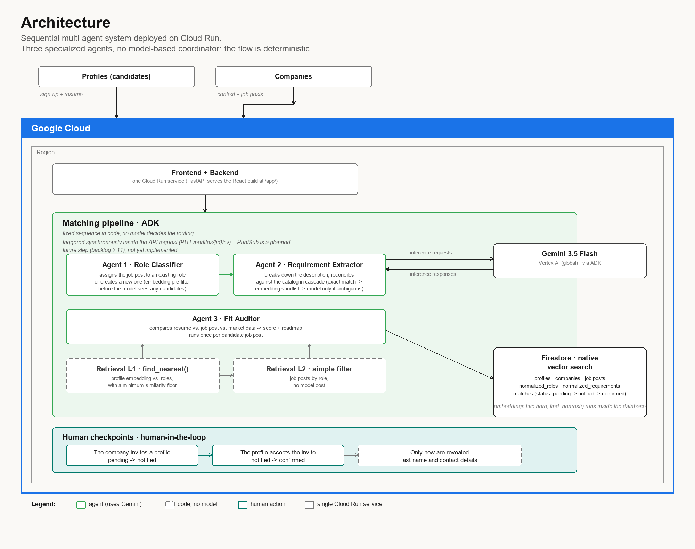

# Rumbo

*"Rumbo" — Spanish for "course" or "direction."*

A matching platform for professional profiles and companies, where a
sequential multi-agent system audits real fit between both sides — and
neither side sees the other until there is explicit, staged consent.

**All Things Agentic Hackathon 2026 — Track: The Taskmaster**

**Live app:** https://rumbo-dev-25592102293.us-central1.run.app/app/
**Health check:** https://rumbo-dev-25592102293.us-central1.run.app/health

---

## What it does

- **The profile** uploads a resume and, as soon as they sign in, sees the
  most relevant job posts with a fit score and a roadmap of what's missing —
  no searching, and without knowing which company posted them.
- **The company** provides its context and job post descriptions, and
  receives a map of matching profiles — without last names or contact
  details.
- **Reveal is staged**: the company manually invites, the profile accepts,
  and only then are identifying details shared.

Matching supports human decisions; it does not make hiring decisions
automatically.

---

## Status

**Fully implemented and validated end-to-end against the live Cloud Run
deployment** — this is not a scaffold. All three agents run real Gemini
reasoning (no deterministic/keyword fallback), and the full flow
(registration → matching → invitation → opt-in → staged disclosure) has
been run repeatedly against production with no manual intervention.

| Feature | Status |
|---|---|
| Auth (password + session token) | ✅ |
| Profile CRUD + CV data | ✅ |
| Company & job post CRUD | ✅ |
| Role Classifier agent (real Gemini reasoning via ADK) | ✅ |
| Requirement Extractor agent (real Gemini reasoning via ADK) | ✅ |
| Fit Auditor agent (real Gemini reasoning via ADK) | ✅ |
| Embedding pre-filter before every agent call (cost control) | ✅ |
| Two-level retrieval (`find_nearest()` + filter, with a similarity floor) | ✅ |
| Match persistence with staged visibility | ✅ |
| Invite / accept / reject lifecycle | ✅ |
| Tests (50) with in-memory fake Firestore + fake Gemini | ✅ |

**Deferred (documented, not blocking)**: async triggering via Pub/Sub —
matching runs synchronously inside the API request instead
(`PUT /perfiles/{id}/cv`); PDF resume parsing and the Harvard-format CV
generator. See `docs/rumbo-backlog.md` for the full backlog and priority.

---

## Architecture

A **sequential multi-agent system** with two human checkpoints. There is no
model-based coordinator agent: the flow is deterministic, so orchestration
is plain code. Model reasoning (Gemini 3.5 Flash, via Google ADK on Vertex
AI) is reserved for the three points where semantic judgment is actually
needed.

### The three agents

| Agent | What it does | When it runs |
|---|---|---|
| **Role Classifier** | Decides whether a job post belongs to an existing normalized role or creates a new one — pre-filters candidates by embedding first, then lets Gemini judge semantic equivalence only among that short list | When a job post is created or edited |
| **Requirement Extractor** | Extracts discrete requirements from the description, then reconciles them against the catalog in cascade: exact string match (free) → embedding shortlist (cheap) → Gemini only for what's still ambiguous (one batched call) | When a job post is created or edited |
| **Fit Auditor** | Computes a score and a quantitative roadmap comparing the resume against the job post and against how common each requirement is across the role (market frequency, derived live — not a stored flag) | Once per candidate job post |

The embedding pre-filter exists so cost and latency stay flat as the
catalog of roles/requirements grows, instead of sending the entire catalog
to Gemini on every call.

### Two-level retrieval

1. **Level 1** — `find_nearest()` (Firestore native vector search) of the
   profile's embedding against `roles_normalizados`, with a minimum
   similarity floor (calibrated against real embeddings, not guessed) so a
   profile with no real overlap doesn't get forced matches.
2. **Level 2** — simple filter of `puestos` by `rol_normalizado_id`
   (no vectors, no LLM cost).

Only over that narrowed set does the Fit Auditor run.



---

## Stack

| Component | Technology |
|---|---|
| Model | Gemini 3.5 Flash, via Vertex AI (required to run in the `global` location for this project) |
| Agent framework | Google ADK (`LlmAgent` + `InMemoryRunner`) |
| API | FastAPI (Python 3.12+) |
| Database | Firestore, native mode, with native vector search |
| Compute | Cloud Run (single service serves both the API and the React build) |
| Validation | Pydantic v2 |
| Frontend | React + Vite, mounted at `/app/` on the same Cloud Run service |

---

## Local setup

### 1. Prerequisites

- Python 3.12+
- Node 18+ (only if you want to rebuild the frontend)
- A Google Cloud project with Vertex AI and Firestore (native mode) enabled
- (Optional) `gcloud` CLI, if you want the local Firestore emulator instead
  of a real project

### 2. Clone and install

```bash
git clone https://github.com/MelZarate-science/Rumbo.git
cd Rumbo

python -m venv .venv
source .venv/bin/activate        # on Windows: .venv\Scripts\activate

pip install -r requirements.txt
```

### 3. Environment variables

```bash
cp .env.example .env
```

Fill in `.env` with your project's values (see `.env.example` for what each
one does). **The real `.env` is never committed.**

To run against the local Firestore emulator instead of a real project:

```bash
# Terminal 1: start the emulator
gcloud emulators firestore start --host-port=localhost:8080

# Terminal 2: export the variable and run the app
export FIRESTORE_EMULATOR_HOST=localhost:8080
uvicorn main:app --reload --port 8080
```

The Firestore SDK detects `FIRESTORE_EMULATOR_HOST` automatically.

**Required vector indexes** (against real Firestore, not the emulator):
without these, `find_nearest()` fails with `Missing vector index
configuration`. Created once per project — one for profile-to-role
retrieval, one for the embedding pre-filter the agents use when
classifying a new job post:

```bash
gcloud firestore indexes composite create \
  --project=YOUR-PROJECT-ID \
  --collection-group=roles_normalizados \
  --query-scope=COLLECTION \
  --field-config=field-path=embedding,vector-config='{"dimension":"1536","flat":"{}"}'

gcloud firestore indexes composite create \
  --project=YOUR-PROJECT-ID \
  --collection-group=requisitos_normalizados \
  --query-scope=COLLECTION \
  --field-config=field-path=embedding,vector-config='{"dimension":"1536","flat":"{}"}'
```

Takes a few minutes to reach `READY` (`gcloud firestore indexes composite
list` to check). If `gcloud` gives you quoting trouble on Windows/PowerShell
with the `vector-config` JSON, you can create the index via API instead with
`google.cloud.firestore_admin_v1.FirestoreAdminClient().create_index(...)`.

### 4. Run tests (no GCP needed)

```bash
python -m pytest tests/ -v
```

All 50 tests use `tests/fakes.py` (an in-memory Firestore) and
`tests/fakes_gemini.py` (a deterministic double for Gemini), so **no
credentials or emulator are required** to run them.

### 5. Seed sample data (requires the emulator or a real GCP project)

```bash
export FIRESTORE_EMULATOR_HOST=localhost:8080  # or use your real GCP project
python -m scripts.seed_data
```

Creates 6 profiles, 6 companies with 9 job posts (with a couple of
deliberately overlapping roles across different companies, to exercise the
role-normalization logic), and runs real matching for every profile. Every
seeded account uses the password `rumbo2026`.

### 6. Verify

```bash
curl http://localhost:8080/health
# {"status":"ok","service":"rumbo"}
```

---

## Try it live

The deployed app already has seed data loaded. Two accounts to try, both
with password `rumbo2026`:

- **Profile**: `ana.garcia@email.com` (has several existing matches, good
  for seeing the fit score and roadmap)
- **Company**: `talento@technova.io` (has job posts loaded, good for seeing
  the profile map and the invite flow)

When logging in, make sure the correct tab ("I'm a profile" / "I'm a
company") is selected before typing the email — it defaults to "profile."

---

## API Endpoints

### Auth
| Method | Path | Description |
|---|---|---|
| POST | `/auth/login` | `{email, password, tipo}` → `{token, id, tipo}` |

### Profiles
| Method | Path | Description |
|---|---|---|
| POST | `/perfiles` | Create profile (also logs in) |
| GET | `/perfiles/{id}` | Get profile (owner view) |
| PUT | `/perfiles/{id}` | Edit personal data |
| PUT | `/perfiles/{id}/cv` | Load/update `cv_data` + **triggers matching** |
| GET | `/perfiles/{id}/matches` | Profile's matches (company hidden while `pendiente`) |

### Companies
| Method | Path | Description |
|---|---|---|
| POST | `/empresas` | Create company (also logs in) |
| GET | `/empresas/{id}` | Get company |
| PUT | `/empresas/{id}` | Edit company |
| POST | `/empresas/{id}/puestos` | Create job post + **triggers indexing** (classification + requirement extraction) |
| GET | `/empresas/{id}/puestos` | List active job posts |
| GET | `/empresas/{id}/mapa-perfiles` | Company's matching profiles (profile fields filtered by match state) |

### Job posts
| Method | Path | Description |
|---|---|---|
| GET | `/puestos/{id}` | Get job post |
| PUT | `/puestos/{id}` | Edit job post (re-indexes if title/description changes) |

### Matches (opt-in flow)
| Method | Path | Description |
|---|---|---|
| GET | `/matches/{id}` | Match with visibility filtered by current state |
| POST | `/matches/{id}/invitar` | **Company** invites (`pendiente` → `notificado`) |
| POST | `/matches/{id}/responder` | **Profile** responds, body `{"aceptar": true\|false}` (`notificado` → `confirmado` / `rechazado`) |

---

## Staged visibility (product rule)

| State | Profile sees company | Company sees last name/email/phone |
|---|---|---|
| `pendiente` | ❌ (only `empresa_id`) | ❌ |
| `notificado` | ✅ (company name) | ❌ |
| `confirmado` | ✅ | ✅ |
| `rechazado` | ✅ | ❌ |

Logic lives in `backend/services/invitaciones.py`
(`filtrar_campos_visibles`, `es_empresa_visible`).

---

## Deploying to Cloud Run

Copy `.env` into a YAML file (same variable names, no extra quoting) and use
`--env-vars-file` — more reliable than `--set-env-vars` when a value has
special characters (e.g. `FIRESTORE_DATABASE_ID=(default)`):

```bash
gcloud run deploy rumbo-dev \
  --source . \
  --project=YOUR-PROJECT-ID \
  --region us-central1 \
  --allow-unauthenticated \
  --env-vars-file=env.yaml
```

Minimum variables the service needs: `GOOGLE_CLOUD_PROJECT`,
`GOOGLE_GENAI_USE_VERTEXAI=True`, `GOOGLE_CLOUD_LOCATION=global`,
`VERTEX_AI_LOCATION=global`, `FIRESTORE_DATABASE_ID`, `GEMINI_MODEL_FLASH`,
`GEMINI_EMBEDDING_MODEL`, `AUTH_SECRET_KEY`, `UMBRAL_FIT_MINIMO` — see
`.env.example`. `GOOGLE_CLOUD_LOCATION`/`VERTEX_AI_LOCATION` must be
`global`: as of this writing, Gemini 3.5 is only served in the `global`
Vertex AI endpoint for this project, not in regional endpoints like
`us-central1`. `GEMINI_API_KEY` is optional and only needed to force the
free Google AI Studio tier instead of Vertex AI; leaving it empty (the
default) is what this project uses. The frontend is served at
`<service-url>/app/`.

Automatic deployment via Cloud Build is not configured yet — deploys are
manual, against the `Dev`/`main` branches in GitHub.

---

## Project structure

```
rumbo/
├── main.py                       # one-line wrapper: `from backend.main import app`,
│                                  # so `uvicorn main:app` keeps working after the
│                                  # backend was moved into backend/
├── agents/                       # the 3 agents that use real Gemini reasoning
│   ├── clasificador_roles.py     # Agent 1 — Role Classifier
│   ├── extractor_requisitos.py   # Agent 2 — Requirement Extractor
│   ├── auditor_fit.py            # Agent 3 — Fit Auditor
│   └── prompts/                  # system prompts, one file per agent/step
├── backend/                      # FastAPI: routes, models, services, real entrypoint
│   ├── main.py                   # actual entrypoint (mounts routes + the frontend build)
│   ├── pipeline/matching_pipeline.py  # plain-code orchestration, not an agent
│   ├── services/                 # logic with no model reasoning
│   │   ├── firestore_client.py   # single access point to Firestore
│   │   ├── gemini_client.py      # single access point to Gemini
│   │   ├── embeddings.py         # embedding generation (profiles, roles, requirements)
│   │   ├── retrieval.py          # two-level retrieval
│   │   ├── normalizacion.py      # role frequency table (transactional)
│   │   ├── invitaciones.py       # match lifecycle + staged visibility
│   │   ├── auth.py                # password hashing + session tokens
│   │   └── cv_generator.py       # Harvard-format CV (not implemented yet)
│   ├── models/                   # one Pydantic class per collection
│   └── routes/                   # HTTP endpoints
├── frontend/                     # React + Vite, served from the same Cloud Run service
├── scripts/seed_data.py          # reproducible seed data
├── tests/                        # 50 tests, fake Firestore + fake Gemini
└── docs/
    ├── architecture-diagram-en.png
    ├── rumbo-contrato-interfaces.md   # endpoint/field naming contract
    ├── rumbo-schema-bd.md             # Firestore schema, collection by collection
    ├── rumbo-backlog.md               # full task backlog with priorities
    ├── rumbo-flujo-trabajo.md         # team workflow (branches, commits, credentials)
    └── rumbo-spec-tecnico.md          # technical spec / design rationale
```

---

## Team rules

- No one pushes directly to `main` or `Dev`. Every change starts on a
  `feature/<description>` branch.
- No one calls Firestore outside of `backend/services/firestore_client.py`,
  or Gemini outside of `backend/services/gemini_client.py`.
- Field, endpoint, and function names are fixed in
  `docs/rumbo-contrato-interfaces.md`. If a new one is needed, it's added
  there first.
- No credentials in code or in commits.

See the full team documentation in `docs/` for details (in Spanish — the
team's working language; this README and the submission materials are in
English per the contest rules).
