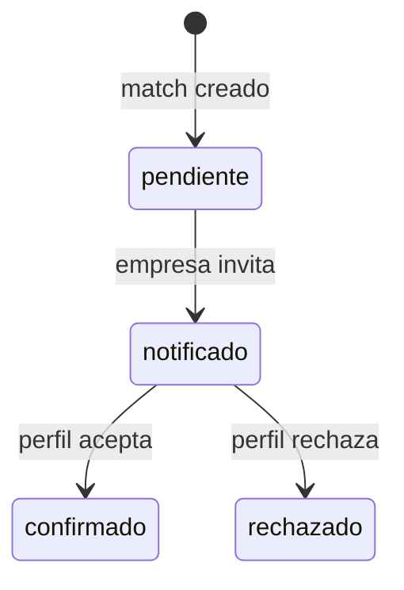

# Rumbo — Contrato de Interfaces
### Convenciones de nombres y endpoints — de cumplimiento obligatorio para todo el equipo

> Este documento se para entre el esquema de base de datos y los prompts de desarrollo de cada persona. Nadie inventa un nombre de variable, función o endpoint que no esté acá — si hace falta uno nuevo, se agrega a este documento primero y se avisa al equipo, no se decide en solitario dentro de una rama.

---

## 1. Convenciones generales de nombres (Python)

| Elemento | Convención | Ejemplo |
|---|---|---|
| Variables y funciones | `snake_case` | `calcular_score_fit`, `perfil_id` |
| Clases | `PascalCase` | `Perfil`, `RolNormalizado` |
| Constantes | `MAYUSCULAS_CON_GUION_BAJO` | `UMBRAL_FIT_MINIMO = 75` |
| Archivos y módulos | `snake_case`, en inglés o español pero consistente (se eligió **español**, porque el dominio del producto es en español) | `auditor_fit.py`, `firestore_client.py` |
| Nombres de campos en Firestore | `snake_case`, siempre en español, **exactamente como figuran en el esquema de base de datos** | `nombre_empresa`, `rol_normalizado_id` |

**Regla de oro:** los nombres de campos en el código (diccionarios, clases, JSON de requests/responses) tienen que ser **idénticos** a los nombres de campos del esquema de Firestore. Nunca traducir, abreviar, ni cambiar de `snake_case` a `camelCase` en ningún punto del sistema — ni en el backend, ni en el frontend, ni en las respuestas de la API.

---

## 2. Convención de endpoints (REST)

- Sustantivos en plural para los recursos: `/perfiles`, `/empresas`, `/puestos`, `/matches`.
- El verbo lo da el método HTTP (`GET`, `POST`, `PUT`), nunca el nombre del endpoint (nada de `/crear-perfil` o `/get-matches`).
- IDs de recurso en la URL, no en el body: `/perfiles/{perfil_id}`.
- Acciones que no son CRUD puro (como "invitar" o "responder a una invitación") van como sub-recurso con verbo en infinitivo: `/matches/{match_id}/invitar`.

---

## 3. Lista de endpoints

### Auth

| Método | Endpoint | Body / Params | Responde |
|---|---|---|---|---|
| `POST` | `/auth/login` | `{email, password, tipo: "perfil" \| "empresa"}` | `{token, id, tipo}` |

El registro (`POST /perfiles` / `POST /empresas`) ya devuelve `token` en la
misma respuesta — es login automático al crear la cuenta, no hace falta
loguearse aparte después de registrarse. El token va en
`Authorization: Bearer <token>` en cada endpoint que lo exige (ver columna
"Requiere sesión" abajo). Formato del token: HMAC firmado con
`AUTH_SECRET_KEY`, expira a los 7 días — ver `backend/services/auth.py`.

### Perfiles

| Método | Endpoint | Body / Params | Responde | Requiere sesión |
|---|---|---|---|---|---|
| `POST` | `/perfiles` | `{nombre, apellido, email, password, telefono?}` | `{perfil_id, token, ...}` | No |
| `GET` | `/perfiles/{perfil_id}` | — | Documento completo del perfil (sin `password_hash`) | No |
| `PUT` | `/perfiles/{perfil_id}` | `{nombre?, apellido?, email?, telefono?}` | Perfil actualizado | Sí (dueño) |
| `PUT` | `/perfiles/{perfil_id}/cv` | `{cv_data: {experiencia, formacion, habilidades, proyectos}}` | `{perfil, matches_creados}` — al guardar, se regenera el `embedding` del perfil | Sí (dueño) |
| `POST` | `/perfiles/{perfil_id}/cv/pdf` | `{}` (usa el `cv_texto_original` ya cargado) | El texto extraído, mapeado a `cv_data` | No |
| `POST` | `/perfiles/{perfil_id}/cv/generar` | `{busqueda_interes: string opcional}` | `{cv_generado_harvard: string}` | Sí (dueño) |
| `GET` | `/perfiles/{perfil_id}/cv/descargar` | — | Archivo PDF | Sí (dueño) |
| `GET` | `/perfiles/{perfil_id}/matches` | — | Lista de `matches` del perfil, con `titulo`, `score`, `roadmap` (array de maps, ver esquema) — **nunca** `nombre_empresa` salvo que el `match` esté en estado `notificado` o posterior | No |

### Empresas y puestos

| Método | Endpoint | Body / Params | Responde | Requiere sesión |
|---|---|---|---|---|---|
| `POST` | `/empresas` | `{nombre_empresa, contexto, email_registro, password}` | `{empresa_id, token, ...}` | No |
| `GET` | `/empresas/{empresa_id}` | — | Documento completo de la empresa (sin `password_hash`) | No |
| `PUT` | `/empresas/{empresa_id}` | `{nombre_empresa?, contexto?}` | Empresa actualizada | Sí (dueña) |
| `POST` | `/empresas/{empresa_id}/puestos` | `{titulo, descripcion}` | `{puesto_id, ...}` | Sí (empresa dueña) |
| `GET` | `/empresas/{empresa_id}/puestos` | — | Lista de puestos de esa empresa | No |
| `PUT` | `/puestos/{puesto_id}` | `{titulo?, descripcion?, activo?}` | Puesto actualizado — si cambia `descripcion`, se vuelve a correr la clasificación y extracción de requisitos | Sí (empresa dueña) |
| `GET` | `/empresas/{empresa_id}/mapa-perfiles` | `?puesto_id=` (opcional) | Lista de `matches` con `nombre` (sin apellido), `score`, `cv_data` — nunca `apellido`, `email`, `telefono` salvo `estado = confirmado` | No |

### Matches (el corazón del flujo de invitación)



[Fuente editable del diagrama](diagrams/rumbo-consent.mmd).

| Método | Endpoint | Body / Params | Responde | Requiere sesión |
|---|---|---|---|---|---|
| `POST` | `/matches/{match_id}/invitar` | `{}` | Match actualizado, `estado: "notificado"` | Sí (empresa dueña del match) |
| `POST` | `/matches/{match_id}/responder` | `{aceptar: boolean}` | Match actualizado, `estado: "confirmado" \| "rechazado"` | Sí (perfil dueño del match) |
| `GET` | `/matches/{match_id}` | — | Documento completo del match, con visibilidad de campos según `estado` (ver esquema de datos) | No |

---

## 4. Convención de nombres de funciones internas (por módulo)

Cada módulo del backend expone funciones con nombres predecibles — así, quien escriba un endpoint sabe de antemano cómo se va a llamar la función que necesita, sin tener que leer el código de otra persona primero.

| Módulo | Función | Qué hace | ¿Usa Gemini? |
|---|---|---|---|
| `agents/clasificador_roles.py` | `clasificar_puesto(puesto_id)` | Asigna `rol_normalizado_id` al puesto (crea el rol si no existe uno cercano). El catálogo que ve Gemini es un pre-filtro por embedding (`find_nearest()`, top 8), no `roles_normalizados` entero | ✅ sí |
| `agents/extractor_requisitos.py` | `extraer_requisitos(puesto_id)` | Extrae requisitos discretos (llamada 1, sin catálogo) y los reconcilia contra `requisitos_normalizados` en cascada: match exacto por string normalizado → shortlist por embedding → solo lo ambiguo se manda a Gemini (llamada 2, batcheada). Actualiza frecuencias vía `backend/services/normalizacion.py` | ✅ sí |
| `agents/auditor_fit.py` | `calcular_score_y_roadmap(perfil_id, puesto_id)` | Devuelve `{score, roadmap, justificacion}` — `roadmap` con la subestructura de maps del esquema, nunca strings sueltos | ✅ sí |
| `backend/pipeline/matching_pipeline.py` | `ejecutar_pipeline_matching(perfil_id)` | Corre el retrieval de dos niveles y dispara el auditor por cada puesto candidato. **No es un agente**: secuencia fija en código | ❌ no |
| `backend/pipeline/matching_pipeline.py` | `ejecutar_pipeline_indexado(puesto_id)` | Al cargarse un puesto: lo clasifica y le extrae los requisitos | ❌ no |
| `backend/services/retrieval.py` | `buscar_roles_afines(perfil_id)` | **Nivel 1**: `find_nearest()` del embedding del perfil contra `roles_normalizados`. Devuelve lista de `rol_normalizado_id` | ❌ no |
| `backend/services/retrieval.py` | `buscar_puestos_de_roles(roles_ids)` | **Nivel 2**: filtro simple de `puestos` por `rol_normalizado_id`. Devuelve lista de `puesto_id` | ❌ no |
| `backend/services/invitaciones.py` | `enviar_invitacion(match_id)` / `procesar_respuesta(match_id, aceptar)` | Cambia el `estado` del match y gestiona qué campos se revelan a cada lado | ❌ no |
| `backend/services/invitaciones.py` | `filtrar_campos_visibles(perfil, estado_match)` | Aplica la regla de visibilidad escalonada sobre un perfil | ❌ no |
| `backend/services/embeddings.py` | `generar_embedding(texto)` / `generar_embedding_perfil(perfil_id)` / `generar_embedding_rol(rol_id)` / `generar_embedding_requisito(requisito_id)` | Genera el embedding (vía `gemini_client`) y lo guarda en Firestore como `Vector` | ❌ no* |
| `backend/services/normalizacion.py` | `actualizar_frecuencias(rol_id, puesto_id, requisitos_ids_nuevos, requisitos_ids_viejos=None)` | Actualiza la tabla de frecuencias del rol dentro de una transacción de Firestore (`actualizar_transaccional`). `puesto_id` se usa para contar `cantidad_puestos` por set real de puestos, no por delta de requisitos. El cuarto parámetro (opcional) es para reindexado idempotente cuando un puesto se edita | ❌ no |
| `backend/services/firestore_client.py` | `obtener(coleccion, doc_id)` / `crear(coleccion, datos)` / `actualizar(coleccion, doc_id, datos)` / `listar(coleccion, filtros)` | Wrappers genéricos, usados por todos los módulos | ❌ no |
| `backend/services/firestore_client.py` | `guardar_embedding(coleccion, doc_id, campo, valores)` | Envuelve `valores` como `Vector` de Firestore y lo guarda — requerido para que `find_nearest()` funcione | ❌ no |
| `backend/services/firestore_client.py` | `buscar_vecinos(coleccion, campo_vector, vector, limite=3, umbral_distancia=None)` | `find_nearest()` — devuelve los documentos más cercanos por similitud coseno. `umbral_distancia` (opcional) descarta candidatos por debajo de cierta similitud, para no forzar `limite` resultados cuando ninguno es relevante | ❌ no |
| `backend/services/firestore_client.py` | `actualizar_transaccional(coleccion, doc_id, fn)` | Lee, transforma (`fn(datos_actuales) -> cambios`) y escribe un documento dentro de una transacción de Firestore — evita que dos escrituras concurrentes sobre el mismo documento se pisen en silencio | ❌ no |
| `backend/services/gemini_client.py` | `generar_json(system_instruction, contents, response_schema, model=None, temperature=0.0)` | Único punto de acceso a Gemini para los 3 agentes: llama al modelo y devuelve la respuesta ya parseada como el modelo Pydantic de `response_schema` | ✅ sí |
| `backend/services/gemini_client.py` | `generar_embedding_vector(texto, model=None)` | Llamada real a la API de embeddings (Google AI Studio o Vertex AI, según `GEMINI_API_KEY`) | ✅ sí |
| `backend/services/cv_generator.py` | `generar_cv_harvard(cv_data, busqueda_interes=None)` | Devuelve el texto del CV formateado | ✅ sí |
| `backend/services/auth.py` | `hashear_password(password)` / `verificar_password(password, hash)` | PBKDF2-HMAC-SHA256 con salt aleatorio | ❌ no |
| `backend/services/auth.py` | `crear_token(sujeto_id, tipo)` / `verificar_token(token)` | Token de sesión firmado con HMAC (`AUTH_SECRET_KEY`), expira a los 7 días | ❌ no |
| `backend/routes/auth.py` | `usuario_actual(authorization)` | Dependency de FastAPI: exige `Authorization: Bearer <token>` válido, devuelve `{sub, tipo, exp}` | ❌ no |

**Sobre la columna "¿Usa Gemini?":** solo lo que está en `agents/` (más el generador de CV) hace llamadas de *razonamiento* al modelo — decisiones, criterio, texto libre. `backend/services/embeddings.py` sí llama a Gemini por debajo (vía `gemini_client.py`) pero es una transformación mecánica (texto → vector), no una decisión — por eso está marcado con *. Todo lo demás es determinístico — esa separación es deliberada y es lo que mantiene bajo el costo y la latencia del sistema.

**Regla de oro:** nadie llama a Firestore directamente desde un endpoint o un agente — siempre a través de `backend/services/firestore_client.py`. Esto evita que cada integrante escriba su propia forma de leer/escribir la misma colección.

---

## 5. Formato estándar de respuestas de error

Todos los endpoints, sin excepción, devuelven errores con esta forma:

```json
{
  "error": true,
  "mensaje": "Descripción legible del problema",
  "codigo": "PERFIL_NO_ENCONTRADO"
}
```

`codigo` es un string en `MAYUSCULAS_CON_GUION_BAJO`, específico del caso (no un código HTTP genérico). Cada quien que agregue un caso de error nuevo, define su propio `codigo` siguiendo este patrón y lo suma a este documento.

---

## 6. Qué hacer si hace falta un endpoint o campo que no está acá

1. Se avisa al equipo (no se decide en solitario dentro de una rama).
2. Se agrega a este documento, con el mismo formato de tabla que las secciones de arriba.
3. Recién ahí se escribe el código que lo usa.

Este documento es la fuente de verdad de nombres — si el código y este documento no coinciden, gana este documento, y el código se corrige.

---

*Este contrato es lo que permite que los prompts de desarrollo de cada integrante se armen en paralelo sin que nadie tenga que adivinar cómo llamó otro a algo. El esqueleto del repo ya refleja estos nombres.*
