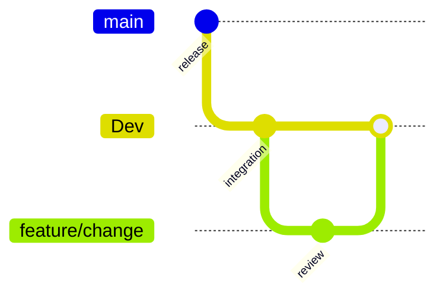

# Rumbo — Flujo de Trabajo del Equipo
### Leer antes de tocar el repo. Aplica a todos por igual.

> **Nota sobre el nombre de este archivo:** este documento es el que cada integrante le va a dar como contexto a su asistente de IA de desarrollo. Cada uno debe copiarlo y renombrarlo según la herramienta que use — `GEMINI.md` si trabaja con Gemini, `CLAUDE.md` si trabaja con Claude, etc. El contenido es el mismo para todos; solo cambia el nombre del archivo según qué asistente lo va a leer.

---

## 1. Estructura de carpetas del repo

```
rumbo/
├── README.md                    # instrucciones de setup y spin-up (obligatorio para submission)
├── requirements.txt
├── Dockerfile                   # imagen para desplegar en Cloud Run
├── .env.example                 # plantilla de variables de entorno, sin valores reales
├── .gitignore                   # incluye .env, __pycache__/, *.pyc, credenciales locales
├── main.py                      # wrapper de una línea: `from backend.main import app` —
│                                 # así `uvicorn main:app` sigue funcionando sin tocar el Dockerfile
│
├── agents/                      # SOLO los agentes que usan razonamiento de Gemini — vive
│   │                             # fuera de backend/ a propósito, es su propio bloque
│   ├── clasificador_roles.py    # Agente 1 — asigna el puesto a un rol normalizado
│   ├── extractor_requisitos.py  # Agente 2 — extrae requisitos y actualiza frecuencias
│   ├── auditor_fit.py           # Agente 3 — score + roadmap cuantitativo
│   └── prompts/                 # system prompts de cada agente, en archivos separados
│       ├── clasificador_roles_prompt.txt
│       ├── extractor_requisitos_paso1_prompt.txt  # extracción, sin catálogo
│       ├── extractor_requisitos_paso2_prompt.txt  # reconciliación batcheada de lo ambiguo
│       └── auditor_fit_prompt.txt
│
├── backend/                     # FastAPI: rutas, modelos, servicios, entrypoint real
│   ├── main.py                  # entrypoint real (expone el backend en Cloud Run)
│   │
│   ├── pipeline/
│   │   └── matching_pipeline.py # orquestación en código plano — NO es un agente:
│   │                             # la secuencia es fija, ningún modelo decide el enrutamiento
│   │
│   ├── services/                # lógica sin razonamiento de modelo
│   │   ├── firestore_client.py  # único punto de acceso a Firestore
│   │   ├── gemini_client.py     # único punto de acceso a Gemini
│   │   ├── embeddings.py        # generación de embeddings (perfil, roles, requisitos)
│   │   ├── retrieval.py         # retrieval de dos niveles (find_nearest + filtro por rol)
│   │   ├── normalizacion.py     # frecuencias de requisitos por rol (transaccional)
│   │   ├── invitaciones.py      # ciclo de vida del match y visibilidad escalonada
│   │   ├── auth.py              # hash de password + tokens de sesión
│   │   └── cv_generator.py      # generación del CV en formato Harvard (Fase 3, sin implementar)
│   │
│   ├── models/                  # una clase por colección, reflejando el esquema de datos
│   │   ├── perfil.py
│   │   ├── empresa.py
│   │   ├── puesto.py
│   │   └── match.py             # solo el enum `EstadoMatch` — el resto del schema vive
│   │                             # en dicts planos, no hay modelos Pydantic muertos acá
│   │
│   └── routes/                  # endpoints HTTP expuestos por el backend
│       ├── auth.py
│       ├── perfiles.py
│       ├── empresas.py
│       ├── puestos.py
│       └── matches.py
│
├── frontend/                    # React + Vite, servido desde el mismo backend en `/app/`
│
├── scripts/
│   └── seed_data.py             # poblar datos ficticios reproducibles
│
├── tests/                       # pruebas, aunque sean básicas
│
└── docs/
    ├── architecture-diagram-en.png
    └── (copia de los documentos del equipo)
```

**Por qué `agents/` tiene solo tres archivos:** un agente es un componente que usa el razonamiento del modelo para decidir algo. El pipeline no decide nada (la secuencia es fija), el retrieval es matemática y consultas, y las invitaciones son cambios de estado. Llamarlos "agentes" sería inflar el conteo — y un jurado técnico que mire el código lo va a notar.

La estructura anterior es la organización vigente del repositorio. Los cambios de código deben respetarla y cualquier cambio de contrato debe reflejarse también en la documentación técnica correspondiente.

---

## 2. Estructura de ramas

```
main        ← rama de release. Nadie pushea directo acá.
  └── Dev     ← rama activa de integración y baseline desplegado.
        ├── feature/1.1-login
        ├── feature/2.9-auditor-agent
        ├── feature/4.2-invitacion-empresa
        └── feature/... (una por cambio)
```

### Reglas



La rama `Dev` es la base de integración; `main` recibe únicamente estados
verificados y listos para release.

1. **Nadie pushea directo a `main` ni a `Dev`.** Todo cambio nace en una rama `feature/` que sale de `Dev`.
2. **Nombrá la rama según el cambio**, por ejemplo `feature/auth-contract` o `feature/auditor-agent`.
3. **Antes de pushear tu rama**: traé los últimos cambios de `Dev` (`git pull origin Dev`) y resolvé los conflictos antes de abrir el PR.
4. **Al terminar un cambio**: con la rama actualizada y sin conflictos, abrí un Pull Request contra `Dev`.
5. **Antes de abrir el PR**: probá el cambio de punta a punta. Un PR roto en `Dev` afecta el baseline desplegado.
6. **Revisión del PR**: otra persona debe leer el diff y ejecutar las comprobaciones relevantes antes de aprobar.
7. **`Dev` es la rama de integración y el baseline desplegado actual.** `main` se actualiza desde un estado verificado de `Dev`.
8. **No se cambia el baseline de producción cerca de una demo o entrega sin validarlo previamente.**

### Convención de commits

Formato: `tipo: descripción corta`, usando estos tipos:
- `feat:` — funcionalidad nueva (ej: `feat: registro de empresa con contexto`)
- `fix:` — corrección de un error (ej: `fix: auditor agent no calculaba fit sin CV`)
- `docs:` — cambios de documentación
- `refactor:` — cambio de código que no altera comportamiento
- `test:` — agregar o corregir pruebas

Un commit no tiene que ser perfecto, pero sí tiene que explicar qué cambió y por qué, sin necesitar abrir el diff para entenderlo.

### Manejo de conflictos de merge

La prevención va antes que la resolución: mantener los cambios acotados y actualizar la rama base antes del PR reduce conflictos. Si aparece uno, se resuelve **antes** de pushear y se valida el comportamiento afectado, especialmente si el conflicto toca `backend/models/`, `backend/routes/` o los contratos documentados.

---

## 3. Dónde van las credenciales (GitHub vs. Google Cloud)

Hay dos tipos de credenciales, y van en lugares distintos — no se mezclan:

**1. Credenciales que la aplicación usa mientras corre** (ej: una API key de un servicio de terceros, si en algún momento se agrega alguno): van en **Google Secret Manager**. Cloud Run las lee de ahí en tiempo de ejecución. Nunca se escriben en el código ni se commitean al repo.

**2. Credenciales para que el despliegue automático funcione** (que un push a GitHub dispare un deploy en Google Cloud): se resuelve conectando **Cloud Build directamente al repositorio de GitHub** desde la consola de Google Cloud (integración nativa). Cloud Build usa su propia cuenta de servicio dentro de GCP para desplegar — **no hace falta guardar ninguna credencial de Google dentro de GitHub.**

*(Alternativa, no recomendada para el tiempo que tienen: usar GitHub Actions en vez de Cloud Build requeriría generar una clave de cuenta de servicio y guardarla como Secret en GitHub — Settings → Secrets and variables → Actions. Es un lugar más donde una credencial puede filtrarse por error, así que se descarta a favor de la integración nativa.)*

**Regla simple:** si dudan dónde va algo, la pregunta es "¿esto lo necesita la aplicación corriendo, o lo necesita el proceso de despliegue?" — lo primero va a Secret Manager, lo segundo lo resuelve Cloud Build solo.

**Nunca:**
- Una credencial real en `.env` commiteado (por eso `.env` está en `.gitignore` desde el día 1, y se sube solo `.env.example` con las claves sin valores).
- Una credencial pegada directo en el código "para probar rápido" y después olvidada ahí.

---

## 4. Variables de entorno esperadas

`.env.example` debe listar, como mínimo, las variables que cada quien necesita para levantar el proyecto localmente — sin valores reales:

```
GOOGLE_CLOUD_PROJECT=
GOOGLE_CLOUD_REGION=
FIRESTORE_DATABASE_ID=
VERTEX_AI_LOCATION=
```

Si a lo largo del desarrollo aparece una variable nueva, quien la agrega actualiza `.env.example` en el mismo PR — no se documenta "para después".

---

## 5. Infraestructura y entornos de despliegue

El despliegue actual usa un servicio de Cloud Run y el baseline verificado está asociado a `Dev`:

- **`rumbo-dev`**: baseline desplegado para integración y demostración.
- `main` se mantiene como rama de release sincronizada desde un estado verificado de `Dev`.

Los triggers automáticos no forman parte de la configuración documentada actual; los despliegues deben verificarse explícitamente.

### Preparación de un entorno

El orden importa: cada paso habilita al siguiente. No se saltean pasos ni se paralelizan entre sí.

1. **Repositorio en GitHub** con `main` y `Dev` protegidas.
2. **Dependencias y variables** configuradas desde `requirements.txt` y `.env.example`.
3. **Proyecto GCP** con Vertex AI/Gemini, Firestore y Cloud Run habilitados.
4. **Índices y colecciones de Firestore** configurados según el esquema.
5. **Credenciales de runtime** gestionadas fuera del repositorio.

---

## 6. Qué hacer si algo se rompe cerca de la fecha límite

- Si `Dev` tiene algo roto: **no se actualiza `main`**. Es preferible una versión más chica pero que funcione de punta a punta, a una más completa que se cae en la demo.
- El reglamento no exige que el proyecto esté público/desplegado en el momento exacto de la submission — se puede grabar el video con todo funcionando y después apagar los servicios para no seguir gastando créditos.
- Si el despliegue del servicio de Cloud Run falla después de actualizar `main`, no se investiga bajo presión en el momento — se revierte el cambio (`git revert`) y se vuelve a intentar con calma, no se parchea en caliente sobre producción.

---

## 7. Checklist final antes de la submission

- [ ] `main` refleja exactamente lo que se muestra en el video — nada se cambia ahí después de grabar.
- [ ] El README permite que alguien externo levante el proyecto sin tener que preguntarle nada al equipo.
- [ ] Ninguna credencial real aparece en el historial de commits (revisar, no asumir).
- [ ] Los dos servicios de Cloud Run pueden apagarse después de grabar el video sin perder nada necesario para la submission.

---

*Este documento se actualiza si el equipo decide cambiar algo del proceso — no es una regla fija e inamovible, pero mientras esté vigente, aplica para todos por igual.*
