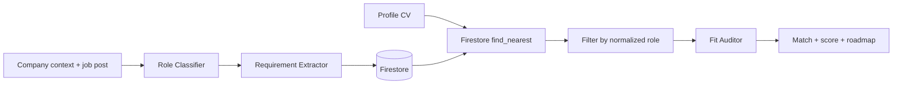

# Rumbo (nombre a confirmar) — Propuesta v2
### All Things Agentic Hackathon 2026 · Track: Taskmaster

> **Qué es este documento:** el spec del producto — explica *qué es* y *por qué* cada decisión. Si este documento y el código no coinciden en una decisión de producto, gana este documento. Para nombres de campos y endpoints, la fuente de verdad es `rumbo-contrato-interfaces.md`; para estructura de datos, `rumbo-schema-bd.md`.

---

## 1. Pitch y propuesta de valor

Una plataforma de **doble registro** — empresas y perfiles — donde un agente audita el fit real entre ambos y le muestra a cada lado lo que le sirve, sin que nadie tenga que buscar manualmente ni salir a rastrear bolsas de empleo externas.

**Frase ancla:** *"La empresa no busca gente, le da contexto al agente — y el agente hace el resto."*

**La fricción que resuelve (BYOF):** buscar trabajo hoy significa leer decenas de descripciones de puesto, tratar de adivinar cuáles te sirven, y no tener idea de qué te falta para las que no. Del otro lado, las empresas reciben pilas de CVs sin filtrar. El agente hace ese trabajo de cruce por los dos.

---

## 2. Cómo entra la información de las empresas

La empresa **no ejecuta búsquedas** dentro del sistema. Se registra una sola vez y carga lo que en términos de ingeniería de IA sería su **system prompt**: quién es, su cultura, su ambiente de trabajo, a qué tipo de perfil busca en general. Ese perfil queda como **contexto persistente** — la base de conocimiento contra la que el Auditor Agent razona cada vez que evalúa un perfil.

Sobre esa base puede además cargar **descripciones de puesto** como piezas de contenido individuales. No son búsquedas activas ni queries — son entradas dentro del contexto de esa empresa, disponibles para que el agente las cruce contra los perfiles registrados.

**La única acción manual que la empresa ejecuta** es invitar a un perfil puntual de su mapa de resultados (ver sección 4). Todo el trabajo de encontrar, evaluar y rankear lo hace el agente solo.

**Por qué importa para Taskmaster:** mantiene la autonomía del lado del agente. El criterio de Innovation & Operational Utility (40%) premia acción autónoma real, no una herramienta de búsqueda que opera el usuario.

---

## 3. Modelo de doble registro

| | Empresas | Perfiles |
|---|---|---|
| **Qué cargan** | Contexto de la empresa (system prompt) + descripciones de puesto opcionales | Datos personales + CV estructurado |
| **Qué NO hacen** | No buscan perfiles activamente | No postulan activamente a un puesto puntual |
| **Validación en el MVP** | Ninguna — decisión consciente de scope, se declara así en el video | Ninguna — misma lógica |
| **A futuro** | Validación por dominio corporativo + aprobación manual + eventual verificación contra registro público | — |

---

## 4. Visibilidad escalonada: matching a ciegas en los dos sentidos

Este es el corazón ético del producto, y la decisión de diseño más distintiva frente a cualquier bolsa de trabajo existente.

**Ninguno de los dos lados ve al otro hasta que hay consentimiento explícito.**

| Momento | Qué ve el **perfil** | Qué ve la **empresa** |
|---|---|---|
| Apenas se registra | Sus puestos más afines, con score y roadmap — **sin saber de qué empresa son** | — |
| La empresa mira su mapa | — | Nombre de pila, % de fit, contenido del CV — **sin apellido ni datos de contacto** |
| La empresa invita (acción manual) | Recién acá ve **qué empresa** lo invitó y el detalle completo del puesto | — |
| El perfil acepta | — | Recién acá ve apellido y contacto |
| El perfil rechaza | — | Nunca ve los datos completos |

**Decisión de lenguaje:** antes del consentimiento se habla de **"perfil"**; después de que acepta, pasa a ser **"candidato"**. No es un detalle cosmético — nombra el hecho de que hasta ese momento la persona no postuló a nada.

**Human-in-the-loop en los dos lados:** el agente decide *a quién mostrar*, pero nunca decide *a quién contactar*. Invitar es una acción humana del lado de la empresa; aceptar es una acción humana del lado del perfil.

---

## 5. Funcionalidades

**1. Registro y carga de CV estructurado** — datos personales + experiencia, formación, habilidades y proyectos, cada uno con su estructura propia (fechas, descripciones), no texto plano.

**2. Motor de afinidad: score + roadmap cuantitativo** — el perfil ve sus posiciones más afines apenas entra, sin pedir nada. Al entrar a una, ve su score y un roadmap que no es una lista genérica de gaps: dice qué porcentaje de los puestos de ese rol pide cada requisito, cuáles ya cumple, y cuáles son particularidades de esa empresa puntual y no un estándar del mercado.

**3. Generación de CV asistida por IA** — a partir del CV estructurado, genera una versión en formato Harvard, adaptable a una búsqueda puntual que indique el usuario, descargable en PDF.

**4. Mapa de perfiles para la empresa + invitación con opt-in** — la empresa ve los perfiles más afines a su puesto, con visibilidad limitada, e invita manualmente a quien le interese.

---

## 6. Arquitectura

```
   AL CARGARSE UN PUESTO                 AL REGISTRARSE UN PERFIL
   (rama de indexado)                    (rama de matching, vía Pub/Sub)
           │                                        │
           ▼                                        ▼
  ┌──────────────────┐                    ┌──────────────────┐
  │  AGENTE 1        │                    │  embedding       │  ← sin modelo
  │  Clasificador    │  ◄── Gemini        │  del CV          │
  │  de roles        │                    └────────┬─────────┘
  └────────┬─────────┘                             ▼
           ▼                              ┌──────────────────┐
  ┌──────────────────┐                    │  Retrieval N1    │  ← sin modelo
  │  AGENTE 2        │                    │  find_nearest    │
  │  Extractor de    │  ◄── Gemini        │  vs. roles       │
  │  requisitos      │                    └────────┬─────────┘
  └────────┬─────────┘                             ▼
           ▼                              ┌──────────────────┐
   puesto indexado                        │  Retrieval N2    │  ← sin modelo
                                          │  filtro por rol  │
                                          └────────┬─────────┘
                                                   ▼
                                          ┌──────────────────┐
                                          │  AGENTE 3        │
                                          │  Auditor de fit  │  ◄── Gemini
                                          │  score + roadmap │
                                          └────────┬─────────┘
                                                   ▼
                                          matches en "pendiente"
                                                   │
                    ═══════ PUNTOS DE CONTROL HUMANO ═══════
                                                   │
                          la empresa invita ──► el perfil acepta
                          (manual)                (manual)
```

**No hay agente coordinador.** El flujo es determinístico: siempre el mismo orden, sin decisiones de enrutamiento. La orquestación vive en `backend/pipeline/matching_pipeline.py` como código plano. Google documenta que el patrón de coordinador agrega llamadas al modelo, costo y latencia — usarlo acá sería complejidad sin beneficio.

### Vista operativa



[Fuente editable del diagrama](diagrams/rumbo-pipeline.mmd).

**Patrón:** secuencial multiagente + human-in-the-loop en dos puntos de control.

### Los tres agentes (los únicos que usan razonamiento del modelo)

| Agente | Función | Cuándo corre |
|---|---|---|
| **Clasificador de roles** | Decide si un puesto pertenece a un rol existente o crea uno nuevo. Requiere criterio semántico real: "Líder de Producto" y "Product Manager" son el mismo rol, "Product Marketing Manager" probablemente no | Una vez por puesto cargado |
| **Extractor de requisitos** | Descompone la descripción en requisitos discretos y los reconcilia contra los existentes ("SQL" = "manejo de bases de datos"). Después actualiza las frecuencias del rol | Una vez por puesto, después del Agente 1 |
| **Auditor de fit** | Compara el CV contra el puesto y contra las frecuencias de mercado. Devuelve score + roadmap con qué cumple, qué le falta, y qué es particularidad de esa empresa | Una vez por puesto candidato |

**Lo que deliberadamente NO usa el modelo:** embeddings, ambos niveles de retrieval, cambios de estado del match y filtrado de campos. Son operaciones determinísticas — mantenerlas fuera del modelo es lo que hace el sistema barato y rápido.

**Protocolos entre agentes:** ninguno (A2A, MCP, ANP, Agora). Los agentes son intra-proceso, llamados en orden fijo por el pipeline — no hay nada que descubrir ni negociar. Esos protocolos serían el camino si a futuro se expusiera el matching a agentes de terceros.

**Por qué el retrieval es de dos niveles:** comparar el embedding del perfil contra *todos* los puestos individuales es redundante — veinte "Product Manager" de veinte empresas distintas son semánticamente casi iguales. En cambio, se compara contra `roles_normalizados` (una capa chica, que crece lento), y recién con el rol identificado se filtran los puestos reales con una consulta simple, sin costo de vector ni de LLM. El detalle completo está en el esquema de base de datos.

**Normalización progresiva:** cuando una empresa carga un puesto, Gemini lo clasifica contra los roles existentes (o crea uno nuevo), extrae sus requisitos discretos, y actualiza la tabla de frecuencias del rol. Así, la referencia de "qué pide el mercado" se construye sola a medida que entran empresas, sin que nadie arme una taxonomía a mano.

**Nota de honestidad para el pitch:** con los pocos puestos de la demo, esos porcentajes van a ser poco significativos estadísticamente (100% o 0%, sin términos medios). El mecanismo queda demostrado y funcionando; decir esto explícitamente en el video es mejor que dejar que el jurado lo note solo.

---

## 7. Stack

| Componente | Elección |
|---|---|
| Modelo | Gemini 3.5 Flash para los 3 agentes, vía Vertex AI (requisito obligatorio de la competencia: Gemini 3.5 o superior). Solo disponible en este proyecto a través del endpoint `global` de Vertex -- `us-central1` todavía no lo sirve, devuelve 404 |
| Framework de agentes | Google ADK |
| Base de datos | Firestore, con soporte vectorial nativo (`find_nearest()`) |
| Cómputo | Cloud Run |
| Disparo del pipeline | Síncrono, dentro del mismo request HTTP (`PUT /perfiles/{id}/cv`). Pub/Sub queda diferido |
| Lenguaje | Python |

**Evaluado y descartado para el MVP:** Cloud Talent Solution (potente, pero es infraestructura de producción y agrega setup que no aporta al scope de 8 días) y Spanner Graph (el grafo bipartito roles↔requisitos se resuelve con referencias simples en Firestore a este volumen). Ambos quedan como camino de evolución natural si el producto escala — vale mencionarlos en el pitch como decisiones conscientes, no como desconocimiento.

---

## 8. Fuera de scope (decisiones conscientes, se declaran en el video)

- Validación de identidad de empresas y perfiles
- Entrada de CV por voz (queda como fase 2 / posible bonus de Best Multimodal UX)
- Scraping o integración con bolsas de empleo externas — por términos de servicio de terceros, no solo por tiempo
- Envío automático de postulaciones a sistemas externos
- El anonimato del perfil antes del opt-in tiene límites en rubros muy de nicho (nombre de pila + CV detallado puede ser identificable) — trade-off conocido

---

## 9. Nombre del proyecto

Pendiente de decidir en equipo. Se descartan sufijos tipo "-Agent"/"-Copilot"/"-AI" por regla explícita de la FAQ del hackathon.

Candidatos: **Posta** · Rumbo · Encaje · Norte

---

## 10. Puntos abiertos

1. Nombre final del proyecto (bloquea naming de repo y servicios de Cloud Run, no el desarrollo).
2. Umbral de fit para que un perfil aparezca en el mapa de la empresa — el 75% de la propuesta original es un valor tentativo, a validar con datos de prueba.
3. Cuánto de la normalización de requisitos entra completo al MVP vs. queda simplificado si el tiempo aprieta.

---

*Este documento se mantiene alineado con `rumbo-schema-bd.md`, `rumbo-contrato-interfaces.md` y `rumbo-flujo-trabajo.md`. Si se cambia una decisión de producto acá, hay que revisar los documentos técnicos relacionados.*
